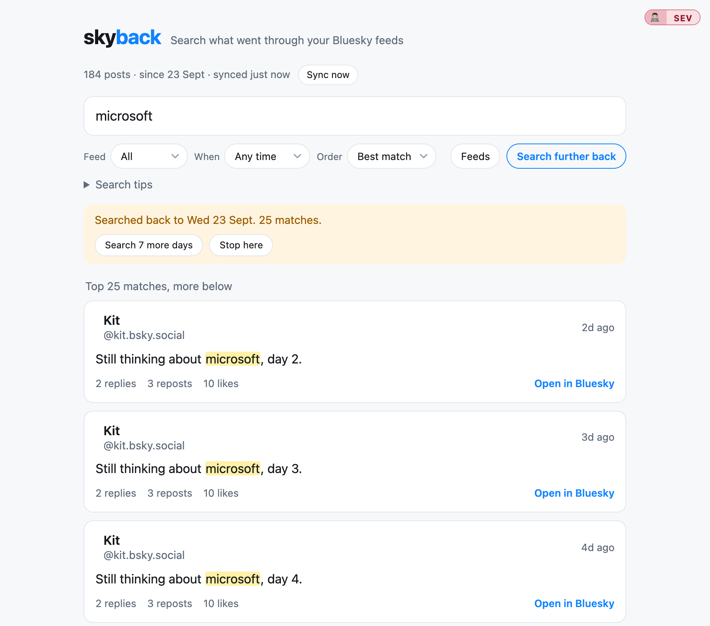

# skyback

**Find the post you read in your own Bluesky feed.**

You know the feeling: you saw a post a few days ago, you remember a word or two of it, and
you cannot find it again. Bluesky's search only looks at posts by a given author or across
the whole network. It has no "posts that were in my timeline" filter, it matches whole
words only, and your timeline is not in the account data export (that only holds your own
posts, likes and follows).

skyback fixes that. It reads your own Following timeline (and any saved feeds you switch
on), keeps a copy in a small database, and gives you full text search over it: words and
word starts, `"exact phrases"`, `from:someone`, dates, and what was inside the post, such
as image alt text, link cards and quoted posts.



A public demo that searches sample posts (from The Onion's public Bluesky feed, not
anyone's own timeline) is at [skyback.sevitz.com/demo](https://skyback.sevitz.com/demo). It
needs no sign-in and touches no database.

## What it pulls down, and when

skyback only has what it has read, so it matters how far back it has read.

- **First sync.** Reads the newest posts from your Following timeline: up to 100 per run,
  as two pages of 50. That keeps every run small enough for Cloudflare's free plan.
- **Staying up to date.** Opening the page checks the time of the last sync and, if it is
  more than 15 minutes old, fetches whatever is new. A cron runs once a day (05:17 UTC) as
  a safety net, so posts you saw yesterday are there even if you did not open the page.
  **Sync now** does the same on demand.
- **Going older.** The archive is not filled in the background. Type a search and press
  **Search further back**: skyback walks back through your timeline one day (24 hours) at a
  time, searching again after each day and showing the matches, and after 7 days it stops and
  asks whether to carry on. Stop it whenever you like, and the next run resumes where it left
  off. Bluesky only lets a timeline be read backwards from the newest post, so reaching day 7
  means reading days 1 to 6 first.
- **What you see.** The status line at the top reads like `1,146 posts · since 6 Sept ·
  synced 8m ago`. "Since" is the date of the oldest post held, and a repost carries its
  original post's date, so it can be earlier than how far back the timeline has been read.

It runs on Cloudflare's free plan and watches its own database use, pausing until midnight
UTC rather than ever tipping the account over its daily allowance.

## Built for Cloudflare

skyback is designed to run on Cloudflare, and its architecture follows from that. If you
want it somewhere else, expect to change the parts below rather than just move the files.

| Piece | On Cloudflare | Elsewhere you would need |
| --- | --- | --- |
| Runtime | A Worker (`src/worker/index.js`) with `fetch` and `scheduled` handlers | Your own server or function platform in front of the same handlers |
| Storage | D1 (SQLite) with an FTS5 full text index, behind a `DB` binding | Any SQLite with FTS5 (the tests already run the real queries on Node's built-in SQLite), or a port of the SQL |
| Schedule | One cron trigger in `wrangler.toml` | A scheduler such as system cron calling the same sync |
| Secrets | Worker secrets (`wrangler secret put`) | Environment variables or your platform's secret store |
| Sign-on | The author's sign-on service, checked in `requireIdentity()` | Your own login or an access proxy |
| Build | wrangler's bundler, with the page and its script imported as text modules | Another bundler that can do the same |

Two design choices come straight from Cloudflare's free plan and would change elsewhere:

- **Small runs.** Each sync is capped at 100 posts and a dozen Bluesky requests, because a
  free Worker gets about 10 ms of CPU and 50 outgoing requests per invocation. On a normal
  server those limits (`MAX_ITEMS_PER_RUN`, `MAX_FETCHES_PER_RUN` and friends in
  `wrangler.toml`) could be raised or removed, and "Search further back" would need fewer
  steps per day.
- **The D1 budget guard.** D1's free allowance is shared by every app on the account, and
  going over it fails them all until midnight UTC, so skyback counts its own rows read and
  written and pauses itself well short of the limit (`src/worker/store.js`). Another
  database would not need it.

The Bluesky side is not tied to Cloudflare: it is a small AT Protocol client
(`src/worker/bsky.js`) that uses an app password and plain `fetch`.

## Searching

Plain words, all of which must appear; longer words also match as prefixes. Plus
`"a phrase"`, `-leave_out`, `this OR that`, `from:handle`, `has:image|video|link|quote|media|reply`
(and `-has:`), `since:YYYY-MM-DD`, `until:YYYY-MM-DD`. Image alt text, link cards, quoted
posts and full link addresses are searched as well as the post text. Accents fold.

## Running your own

skyback is one person's tool on one Cloudflare account, and the code reflects that. To run
your own copy:

1. Install and test: `npm install`, then `npm test` and `npm run smoke`.
2. Create your database with `npx wrangler d1 create skyback`, then put your account id,
   the new database id and your own route in `wrangler.toml` (they currently hold the
   author's).
3. Create a Bluesky app password (Settings, Privacy and security, App passwords). Never use
   your account password; an app password can be revoked on its own.
4. Set the secrets (next section), apply the database migration with
   `npm run db:migrate:remote`, and deploy with `npm run deploy`.
5. **Sign-on.** The Worker only admits a signed-in owner, through the author's own sign-on
   service (`AUTH_ISSUER` in `wrangler.toml`, and `requireIdentity()` in
   `src/worker/index.js`, with the client in `src/worker/auth-client`). That service is not
   part of this repo, so nothing will let you in until you replace that gate with your own,
   for example Cloudflare Access in front of the Worker, or a check on a secret of your own.
   The `whoami` and bug-report widgets are part of the same setup and can be removed with it.

## Secrets

Three values, all set on the Worker as secrets:

| Secret | What it is | Needed |
| --- | --- | --- |
| `BSKY_HANDLE` | your Bluesky handle, such as `you.bsky.social` | yes |
| `BSKY_APP_PASSWORD` | a Bluesky app password, never the account password | yes |
| `GITHUB_ISSUES_TOKEN` | a GitHub token that lets the in-app bug button file issues | no |

**How the author does it.** The three values live in a 1Password item (`app.skyback`, vault
`_code_secrets`), and a helper script from the author's private tooling repo, `app-ops`,
pushes them to Cloudflare:

```
zsh ~/Code/app-ops/bin/secrets-sync.sh --check
zsh ~/Code/app-ops/bin/secrets-sync.sh
```

All that script does is read each field with the 1Password CLI (`op read`) and pipe it into
`wrangler secret put`, after checking that every field in the item is listed in
`app-ops.toml`. It is a convenience, not a requirement, and it does not work unless you use
1Password and have that repo.

**If you do not use 1Password**, skip it and set the secrets yourself. Each command asks
you to paste the value, so nothing lands in your shell history:

```
npx wrangler secret put BSKY_HANDLE
npx wrangler secret put BSKY_APP_PASSWORD
```

Add `npx wrangler secret put GITHUB_ISSUES_TOKEN` only if you want the bug button; without
it the button says bug reporting is not configured and everything else works.
`npx wrangler secret list` shows which names are set (never the values). For local
development, put the same names in a `.dev.vars` file (`BSKY_HANDLE=you.bsky.social`, one
per line); it is git-ignored.

## Demo data

`npm run refresh-demo` replaces the demo's sample with a fresh random selection of recent
posts from a public account, via Bluesky's public API (no credentials). Review the diff
and commit it.

## API

All behind the family sign-on (admin only). POSTs need `Origin: https://skyback.sevitz.com`.

| Route | |
| --- | --- |
| `GET /api/health` | public, `{ ok, version }` |
| `GET /api/search?q=&feed=&posted=&sort=new&offset=` | 25 results a page |
| `GET /api/status` | counts, last run, backfill, D1 usage today, database size |
| `GET /api/feeds` | Following and your saved feeds, with on/off |
| `POST /api/feeds/refresh` | reread saved feeds from Bluesky |
| `POST /api/feeds/toggle` `{ uri, enabled }` | switch a feed's archiving |
| `POST /api/feeds/fetch` `{ uri }` | fetch one feed now |
| `POST /api/sync` | run a sync now |
| `POST /api/backfill/step` `{ target? }` | one small step of Search further back |
| `GET /demo` | public demo page (no sign-in, no database) |

## Bug reports

The in-app bug button files a GitHub issue in this repo, and the repo is public, so
reports are public too. Do not put anything personal in one.

## Licence

MIT, see `LICENSE`.
